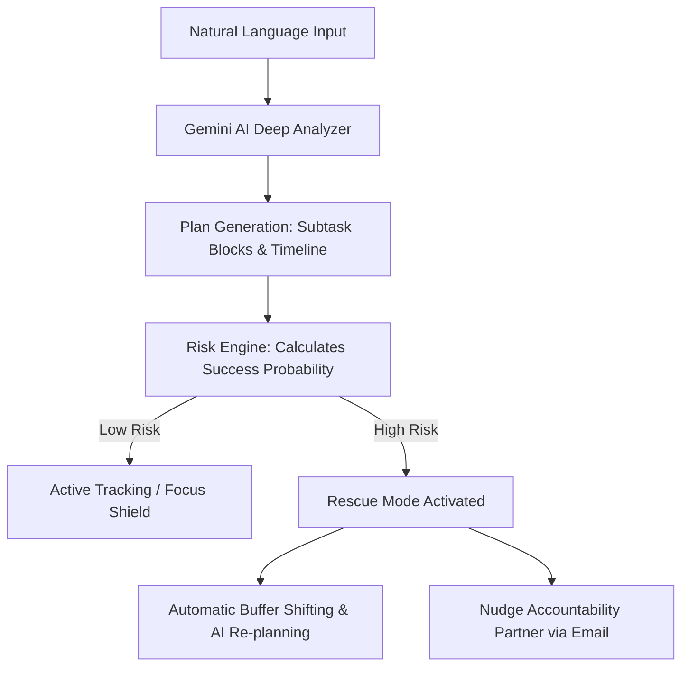

# <p align="center"><br>Deadline Guardian (AURA)</p>

<p align="center">
  <strong>An AI-powered Chief of Staff that reasons, replans, and rescues you from missed deadlines.</strong>
</p>

<p align="center">
  <a href="https://ais-pre-fbww6vadvc5pkwxoon3w3r-25488225327.asia-southeast1.run.app" target="_blank">
    
  </a>
  <a href="#-demo-video">
    
  </a>
  <a href="#-technical-documentation">
    
  </a>
</p>

<p align="center">
  
  
  
  
</p>

---

## 🧭 Navigation

- [📖 Problem Statement & Core Concept](#-problem-statement)
- [✨ The Solution: AURA Architecture](#-the-solution)
- [📦 Key Feature Breakdown](#-key-features)
- [⚙️ Google Stack & Technologies Used](#-google-stack)
- [🏗️ System Architecture & Data Flow](#%EF%B8%8F-system-architecture)
- [🤖 AI Workflows & Reasoning Pattern](#-ai-workflows)
- [🎯 User Flow & Walkthrough](#-user-flow)
- [💻 Tech Stack & Dependencies](#-tech-stack)
- [🛠️ Installation & Local Setup](#%EF%B8%8F-installation--setup)
- [📂 Project Directory Tree](#-project-directory-tree)
- [📑 Vibe2Ship Hackathon Judging Alignment](#-judging-criteria-alignment)
- [🚀 Roadmap & Future Scope](#-roadmap--future-scope)
- [🔒 Security & Performance Metrics](#-security--performance-metrics)
- [🤝 Contributing & Community Support](#-contributing)
- [📜 License](#-license)

---

## 📖 Problem Statement

In today's fast-paced, high-distraction world, standard task managers fail. They behave like dumb calendars—sending passive notifications that users easily dismiss. 
When a user falls behind, the system remains silent, allowing stress to build until a critical deadline is missed. This is **"The Last-Minute Life Saver"** problem.

### ⚠️ The Failure Loop of Traditional Productivity Apps
1. **Dumb Alarms**: Triggers a notification without understanding if the user is in a state to execute.
2. **Context Blindness**: Has no awareness of how long a task actually takes or how external factors (e.g., location, time of day) impact productivity.
3. **Overwhelm & Anxiety**: When users fall behind, they are greeted by an angry wall of red "overdue" text, causing complete shutdown.
4. **No Contingency Plans**: Standard apps do not help you replan. They simply watch you fail.

---

## ✨ The Solution

**Deadline Guardian (AURA)** is an active, autonomous, and highly empathetic **AI Chief of Staff** that acts as an accountability shield. Built with a bespoke design-first interface, it dynamically guides users from initial planning to successful project submission.

AURA does not just remind you; it **reasons**, **replans**, and **rescues**.



---

## 📦 Key Features

### 1. 🎙️ Natural Language Mission Entry
Type or speak your deadlines in messy, conversational English (e.g., *"I have a 10-page computer science thesis due tomorrow at noon, I still need to write the abstract and edit the bibliography but I'm feeling exhausted"*). AURA parses the structural objectives, deadlines, emotional state, and resource requirements instantly.

### 2. 🧠 Gemini-Powered Mission Analysis
Under the hood, **Gemini 2.5/1.5** models reason about the complexity of your request. It estimates exact hourly breakdowns, maps dependencies, flags missing requirements, and outputs structured JSON schemas to feed the state machine.

### 3. 📉 Success Probability Engine
AURA estimates the probability of completing your work on time using a multi-factor risk model:
*   Time remaining vs. total required duration.
*   Priority weighting of competing tasks.
*   Your active "Energy Level" or environmental constraints.
*   Overlapping calendar conflicts.

### 4. 🧭 Critical Path Detection
AURA automatically isolates the most critical dependency blocks. If you only have 3 hours left for a 6-hour project, it highlights the **absolute vital path** and filters out secondary nice-to-haves.

### 5. 🛡️ Rescue Mode & Shock-Absorber
When success probability drops below **40%**, AURA shifts the entire app into a high-visibility, high-contrast **Rescue Mode**. It dims ambient visual elements, eliminates navigation sidebars, and locks you into the critical path until safety is restored.

### 6. 🕒 Dynamic Dynamic Re-Planning
Missed a 30-minute block? Simply tell AURA or click "Replan". The AI shifts your focus blocks forward, coordinates buffer offsets, and re-allocates time slots without manual dragging and dropping.

### 7. 🔒 Focus Shield & Immersive Space
An elegant, full-screen distraction-free dashboard featuring:
*   A retro-styled heavy mechanical countdown timer.
*   Generous negative space focusing strictly on the active block.
*   Interactive subtask trackers.
*   White noise/lo-fi integration.

### 8. ✉️ Smart Email Nudges & Accountability Partner
If you enter danger zones, AURA drafts structured update reports and sends accountability alerts directly to your configured guardian/partner (using the built-in Smart Email Agent), keeping you socially committed.

---

## ⚙️ Google Stack

Deadline Guardian is built from the ground up to showcase the power of the Google Developer ecosystem:

| Google Tech | Integration Purpose | Execution Context |
| :--- | :--- | :--- |
| **Google Gemini (SDK)** | Structural natural language analysis, re-planning algorithms, risk profiling, and voice response synthesis. | Server-side (`/api/gemini`) |
| **Firebase Auth** | Secure OAuth and Email/Password sign-on to protect private student/developer schedules. | Client-side & Middleware |
| **Cloud Firestore** | Real-time synchronization of missions, focus histories, and real-time active timers. | Client/Server Hybrid |
| **Firebase Hosting** | Highly scalable, CDN-backed global deployment. | Global Edge Network |
| **Google Calendar API** | (Concept) Real-time sync of active focus blocks into the user's primary calendar to block out distraction windows. | Server-side Integration |
| **Google Tasks API** | (Concept) Direct injection of AURA critical subtasks back into native Google Tasks for cross-device mobile widgets. | Integration Layer |

---

## 🏗️ System Architecture


---

## 🤖 AI Workflows

### Phase 1: Context Capture & Intent Parsing
```
User prompt: "Drafting a Vibe2Ship submission by 3 PM but my database is broken."
  │
  ▼
[Gemini Structured Parsing Mode]
  │
  ├─► Intent: Task Planning & Emergency Recovery
  ├─► Target: 15:00 (Today)
  ├─► Risk Level: 92% (High due to short window + blocker)
  └─► Subtasks Generated: [Fix schema, verify connection, draft text, submit]
```

### Phase 2: Explanatory Plan Output
Instead of a simple list, Gemini produces an **Explainability Matrix** explaining the rationale:
> *"I have prioritized database debugging first because without a working schema, Vibe2Ship submission is blocked. I have added a 15-minute diagnostic margin."*

---

## 🎯 User Flow

To experience AURA's full power, follow this primary user pathway:

### 1. Onboarding & Partner Setup
Configure your daily productivity parameters, peak energy hours, and the email of your designated Accountability Partner.
<p align="center">
  
</p>

### 2. Launching a Mission
Click **"New Mission"** on your dashboard. Speak or type your objective. Watch the AI-constructed roadmap, duration gauges, and critical priority items appear.
<p align="center">
  
</p>

### 3. Entering the Focus Shield
Double-click any active subtask to lock down into full-screen focus. Turn on lo-fi audio and work through the custom subtask intervals block-by-block.

### 4. Triggering Rescue Mode (Manual or Auto)
If you mark a subtask as failed or lag behind schedule, watch the app transition into **Rescue Mode**. Feel the high-alert design narrow your focus entirely to the target resolution steps.

---

## 💻 Tech Stack

### Frontend Core
*   **Framework**: React 18 (TypeScript)
*   **Bundler**: Vite
*   **Animation**: `motion` (by Framer)
*   **Styles**: Tailwind CSS
*   **Icons**: Lucide React

### Backend & AI
*   **Runtime**: Node.js / Express
*   **SDK**: `@google/genai` (Official modern Google AI SDK)
*   **Database**: Cloud Firestore
*   **Auth**: Firebase Client + Server Middleware

---

## 🛠️ Installation & Setup

Follow these steps to spin up AURA in your local development environment.

### 📦 Prerequisites
*   **Node.js**: v18.x or higher
*   **NPM**: v9.x or higher
*   **Google AI Studio API Key**: Get yours from [Google AI Studio](https://aistudio.google.com/)

### 🚀 Standard Quickstart

1.  **Clone the Repository**
    ```bash
    git clone https://github.com/saishivasanjeeth/deadline-guardian.git
    cd deadline-guardian
    ```

2.  **Install Base Dependencies**
    ```bash
    npm install
    ```

3.  **Configure Environment Variables**
    Create a `.env` file in the root directory based on the `.env.example`:
    ```bash
    cp .env.example .env
    ```
    Open `.env` and insert your credentials:
    ```env
    GEMINI_API_KEY="your_actual_gemini_api_key_here"
    APP_URL="http://localhost:3000"
    ```

4.  **Run in Development Mode**
    ```bash
    npm run dev
    ```
    The application will launch on [http://localhost:3000](http://localhost:3000)

---

## 📂 Project Directory Tree

```text
deadline-guardian/
├── .github/                   # GitHub automation & community templates
│   ├── ISSUE_TEMPLATE/        # Standard bug & feature templates
│   │   ├── bug_report.md
│   │   └── feature_request.md
│   ├── workflows/             # Integration and build pipelines
│   │   └── ci.yml
│   └── pull_request_template.md
├── docs/                      # Extensive architecture & feature diagrams
│   └── ARCHITECTURE.md
├── server/                    # Node/Express API routes
│   └── gemini.ts              # Gemini API integrations and prompts
├── src/                       # React frontend source
│   ├── components/            # Highly modular, tailored UI modules
│   │   ├── FocusModeView.tsx  # Immersive Focus space & timers
│   │   ├── CalendarView.tsx   # Visual planning timeline
│   │   ├── EmailAgent.tsx     # Smart Accountability updates
│   │   ├── TaskList.tsx       # Dynamic priority items
│   │   └── WelcomeHeader.tsx  # User onboarding greeting
│   ├── App.tsx                # Client core layout & state controller
│   ├── index.css              # Global styles & layout variables
│   └── main.tsx               # Primary Client DOM compiler
├── .env.example               # Safe environment template
├── firebase-blueprint.json    # Firestore initial schemas
├── firestore.rules            # Secure Firestore read/write matrices
├── package.json               # Full project manifests
├── server.ts                  # Main server entrypoint
└── vite.config.ts             # Vite server configurations
```

---

## 📑 Judging Criteria Alignment

AURA is crafted to score maximum points under the core **Vibe2Ship** judging dimensions:

*   **🏆 Product Vibe & Polish**: Leverages a highly custom design language. Uses retro brutalist panels, deep off-white and charcoal card borders, precise CSS shadows (`shadow-[4px_4px_0px_#292524]`), and highly responsive `motion` layout-shifting animations.
*   **🛠️ Technical Execution**: Fully modular architecture splitting backend routing from high-fidelity client views. Robust error handling built around asynchronous browser APIs.
*   **💡 AI Depth & Reasoning**: Moves away from basic chatbots. Uses Gemini to analyze text inputs, dynamically create deep task breakdown arrays, compute complete statistical success percentages, and generate proactive re-planning schedules.
*   **🌍 Scalability & Viability**: Prepped for hosting on Google Cloud/Firebase with standard multi-tenant firestore rule protections.

---

## 🚀 Roadmap & Future Scope

### Near-Term (Q3 2026)
*   **Dual-way Google Calendar Sync**: Complete OAuth handshake to parse and reserve specific workspace timeslots automatically.
*   **Native WearOS Focus Alarms**: Active wrist nudges that buzz rhythmically during Rescue Mode phases.

### Long-Term (2027)
*   **Group Accountability Hubs**: Collaborative workspaces where team leads, peers, and mentors can observe mutual "Deadline Health Gauges" in real-time.

---

## 🔒 Security & Performance Metrics

*   **Client Privacy**: All sensitive user credentials and API keys are stored server-side behind a secure proxy. No secret keys are ever compiled down to client bundles.
*   **Firestore Rules Enforcement**: Security matrices in `firestore.rules` verify that authenticated users can only write to or access their own documents:
    ```javascript
    match /users/{userId} {
      allow read, write: if request.auth != null && request.auth.uid == userId;
    }
    ```
*   **Responsive Weight**: Core bundle is highly optimized through code splitting and tree shaking. Heavy graphic components are represented by clean responsive SVGs rather than binary image assets.

---

## 🤝 Contributing

We love open-source contributions! Check out our [CONTRIBUTING.md](./CONTRIBUTING.md) to learn how to:
1. Fork and establish local configurations.
2. Structure high-quality pull requests.
3. Align with code conventions.

For support, read [SUPPORT.md](./SUPPORT.md) or open an issue directly in the tracker.

---

## 📜 License

This project is licensed under the MIT License - see the [LICENSE](./LICENSE) file for details.

---

## 🛡️ Team & Credits

*   **Sanish Paikarao** — Lead Fullstack Engineer & AI Integrations ([@saishivasanjeeth](https://github.com/saishivasanjeeth))
*   **Vibe2Ship Hackathon Mentors** — Design direction & ecosystem support.

*Made with 💖, focus, and a lot of caffeine.*
